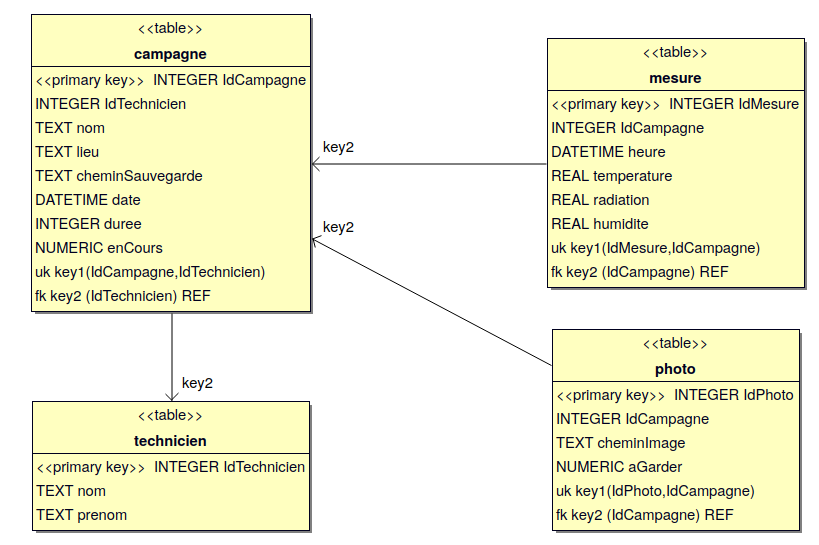

# Projet ROVNET 2020

- [Projet ROVNET 2020](#projet-rovnet-2020)
	- [Auteurs](#auteurs)
	- [Présentation](#présentation)
	- [Base de données SQLite](#base-de-données-sqlite)
	- [Recette](#recette)
	- [Vidéo](#vidéo)
	- [Licence GPL](#licence-gpl)

## Auteurs

- Servan Tenaille <<servan.tenaille@gmail.com>>
- Anthony Bonnet <<bonnet.anthony0@gmail.com>>

## Présentation

Les objectifs du projet ROV'NET sont de se déplacer dans un milieu contaminé afin de faire des prises de vues :

* Le déplacement se fera à partir d'un châssis en liaison filaire à 4 roues motorisées indépendamment.
* Le ROV sera équipé :
    * d'une caméra d'aide au déplacements et/ou de capteurs d'obstacles
    * d'un capteur de température et de radioactivité
    * d'un dispositif de prise de vue motorisé
    * d'un bras de robotique avec pince de préhension

## Base de données SQLite



```sql
PRAGMA foreign_keys = ON;

--
-- Structure de la table `campagne`
--

CREATE TABLE IF NOT EXISTS `campagne` (
	`IdCampagne`	INTEGER PRIMARY KEY AUTOINCREMENT,
	`IdTechnicien`	INTEGER NOT NULL,
	`nom`	TEXT NOT NULL UNIQUE,
	`lieu`	TEXT NOT NULL,
	`cheminSauvegarde`	TEXT NOT NULL,
	`date`	DATETIME NOT NULL,
	`duree`	INTEGER NOT NULL,
	`enCours` NUMERIC NOT NULL,
	UNIQUE(`IdCampagne`, `IdTechnicien`),
	FOREIGN KEY(IdTechnicien) REFERENCES technicien(IdTechnicien)
);

--
-- Structure de la table `mesure`
--

CREATE TABLE IF NOT EXISTS `mesure` (
	`IdMesure`	INTEGER PRIMARY KEY AUTOINCREMENT,
	`IdCampagne`	INTEGER NOT NULL,
	`heure`	DATETIME NOT NULL,
	`temperature`	REAL NOT NULL,
	`radiation`	REAL NOT NULL,
	`humidite`	REAL NOT NULL,	
	UNIQUE(`IdMesure`, `IdCampagne`),
	FOREIGN KEY(IdCampagne) REFERENCES campagne(IdCampagne)
);

--
-- Structure de la table `photo`
--

CREATE TABLE IF NOT EXISTS `photo` (
	`IdPhoto`	INTEGER PRIMARY KEY AUTOINCREMENT,
	`IdCampagne`	INTEGER NOT NULL,
	`cheminImage`	TEXT NOT NULL,
	`aGarder`	NUMERIC NOT NULL,
	UNIQUE(`IdPhoto`, `IdCampagne`),
	FOREIGN KEY(IdCampagne) REFERENCES campagne(IdCampagne)	
);

--
-- Structure de la table `technicien`
--

CREATE TABLE IF NOT EXISTS `technicien` (
	`IdTechnicien`	INTEGER PRIMARY KEY AUTOINCREMENT,
	`nom`	TEXT NOT NULL,
	`prenom`	TEXT NOT NULL
);
```

## Recette

- Servan Tenaille

    * Prendre en charge une manette par le logiciel
    * Recevoir et Visualiser les mesures des capteurs de température et d'irradiation
    * Déplacer le robot
    * Piloter le bras articulé
    * Envoyer les ordres de déplacement au robot et au bras
    * Archiver les mesures

- Anthony Bonnet

    * Démarrer une campagne
    * Visualiser l'environnement (le flux vidéo de la caméra et les données de télémétrie)
    * Recevoir les données de télémétrie
    * Prendre une photo
    * Configurer le contrôle de la caméra
    * Archiver les photos

## Vidéo

Lien : https://www.youtube.com/watch?v=Oadftf1y7SA

## Licence GPL

This program is free software; you can redistribute it and/or modify
it under the terms of the GNU General Public License as published by
the Free Software Foundation; either version 2 of the License, or
(at your option) any later version.

This program is distributed in the hope that it will be useful,
but WITHOUT ANY WARRANTY; without even the implied warranty of
MERCHANTABILITY or FITNESS FOR A PARTICULAR PURPOSE. See the
GNU General Public License for more details.

You should have received a copy of the GNU General Public License
along with this program; if not, write to the Free Software
Foundation, Inc., 59 Temple Place, Suite 330, Boston, MA 02111-1307 USA
